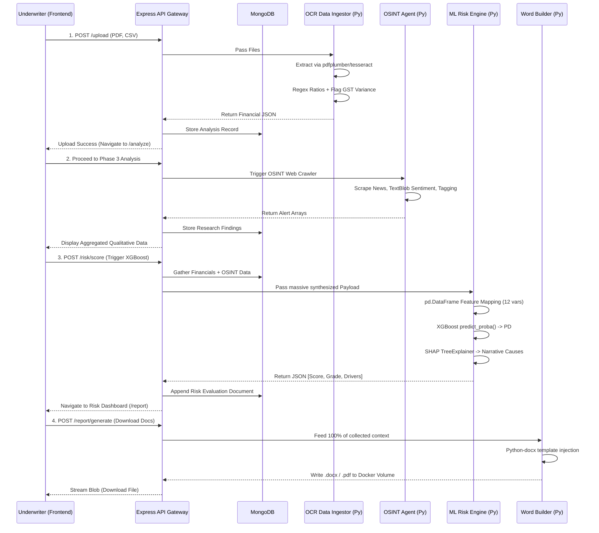

# 🏦 Intelli-Credit: AI-Powered Underwriting Engine

[](https://vitejs.dev/) [](https://nodejs.org/) [](https://fastapi.tiangolo.com/) [](https://www.docker.com/)

An **end-to-end automated Credit Appraisal pipeline** designed to ingest unstructured financial data (Annual Reports, GST filings), compile external intelligence, and compute Probability of Default via XGBoost. Evaluates MSME credit risk instantly and automatically compiles a printable multi-page Credit Appraisal Memo (CAM).

---

## 🚀 Quick Execution (Hackathon Demo Mode)

It takes 1 click to fire up the entire orchestration. Do not run microservices manually—rely on the unified Docker configuration.

1. Ensure Docker Desktop is running.
2. In the root directory, simply run:
   ```bash
   docker-compose up --build -d
   ```
3. Wait approximately `2 minutes` for the `risk-engine` container to finish synthesizing the training dataset and baking the `XGBoost` TreeExplainer into its image.
4. Navigate to **`http://localhost:5173`** 
5. Under 'Upload Files', simply hit **`⚡ Quick Demo (Pre-loaded Profile)`**. This will trigger the pipeline instantly using physical PDF and CSV files generated in the background.

---

## 🧠 Complete Architecture Workflow

Intelli-Credit operates as an asynchronous, non-blocking Multi-Stage Pipeline mimicking the actual workflow sequence of an Institutional Credit Underwriter.



---

## 🔍 System Deep Dives

### 1. Data Ingestion & OCR
The **Phase 2 Extractor Engine** replaces manual data entry.
- **Dual Engine:** Uses `pdfplumber` for native digital files, falling back on `pytesseract` (eng+hin) if images/scans are detected.
- **Intelligent Routing:** Detects whether the file is an Annual Report vs Bank Statement and selectively fires regex groups.
- **Cross Verification:** It compares GSTR-3B filings against Bank Account Turnover records mathematically—if the variance exceeds 15%, it throws a critical structural warning immediately.

### 2. Research & Qualitative Agent
The **Phase 3 OSINT Agent** acts as the Credit Manager running background checks while the financials parse.
- Queries Google News RSS feeds for "Company Name + Litigation/Defaults/News".
- Utilizes `TextBlob` and array mapping to tag snippets as `FRAUD`, `REGULATORY`, or `CRITICAL`.
- Returns an aggregated Sentiment Score mapped internally between `-1.0 to 1.0` allowing the Risk Engine to penalize off-balance-sheet reputation risk.

### 3. Machine Learning Scorecard
The core **Phase 4 Probability of Default (PD)** module utilizes an `XGBoostClassifier` to grade borrowers.
- **Feature Pipeline:** 12 variables (EBITDA margins, DSCR variance, ITC drops, Sentiment scores, Management Quality overrides) are transformed into a normalized 1D vector block.
- **Model Baking:** During `docker build`, it leverages `scikit-learn` to generate a 5,000-sample mock universe of MSME profiles ranging from AA to C grades, fits the model, and serializes it locally via `joblib`.
- **Explainable AI (XAI):** Credit scorecards cannot be blackboxes. A localized `SHAP TreeExplainer` recalculates the marginal odds impact of every variable natively for that specific borrower and returns English readable causal narrative sentences.

### 4. Automated Credit Appraisal (CAM)
A finalized institutional deliverable.
- A `python-docx` builder takes the aggregation of Phases 1-4 and auto-populates a rigid institutional template calculating Expected Loss equations recursively.
- Docker natively binds the `/app/output` drive to the Node `/static/reports/` drive allowing Node to immediately serve the generated Word Doc off the Python container without base64 marshaling.
