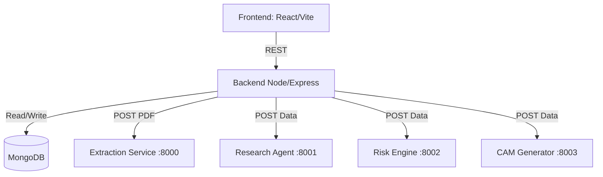

# Architecture Diagram

```mermaid
graph TD
    UI[Frontend: React/Vite] -->|REST| BE[Backend Node/Express]
    BE -->|Read/Write| DB[(MongoDB)]
    BE -->|POST PDF| EXT[Extraction Service :8000]
    BE -->|POST Data| RES[Research Agent :8001]
    BE -->|POST Data| RISK[Risk Engine :8002]
    BE -->|POST Data| CAM[CAM Generator :8003]
```
