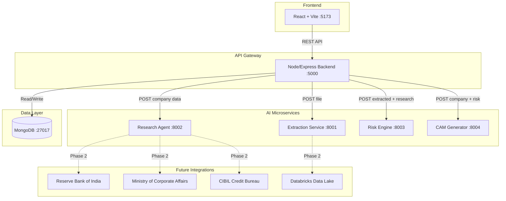

# Architecture — Intelli-Credit

## System Overview

Intelli-Credit is a microservices-based AI engine for automated credit appraisal. It extracts financial data from documents, performs secondary research, computes explainable risk scores, and generates Credit Appraisal Memos (CAMs).

## Architecture Diagram

## Service Responsibilities

| Service | Port | Role |
|---------|------|------|
| **Frontend** | 5173 | React SPA — upload, monitor analysis, view reports |
| **Backend** | 5000 | API gateway — orchestrates pipeline, manages state |
| **Extraction** | 8001 | OCR + financial data parsing from PDFs/DOCX |
| **Research** | 8002 | News, litigation, regulatory alerts aggregation |
| **Risk Engine** | 8003 | Weighted scoring with explainable factors |
| **CAM Generator** | 8004 | DOCX report generation with Five Cs assessment |
| **MongoDB** | 27017 | Persistent storage for companies, financials, analyses |

## Data Flow

1. User uploads document via Frontend
2. Backend stores file and calls Extraction Service
3. Extraction returns structured financial data
4. Backend calls Research Agent for secondary research
5. Backend calls Risk Engine with extracted + research data
6. Risk Engine returns scored risk with factor drivers
7. Backend calls CAM Generator with all aggregated data
8. CAM Generator produces DOCX and Five Cs summary
9. Frontend displays risk dashboard, drivers, and CAM download

## Docker Network

All services communicate over `intelli_network` bridge using container names as hostnames (e.g., `http://extraction-service:8001`).
